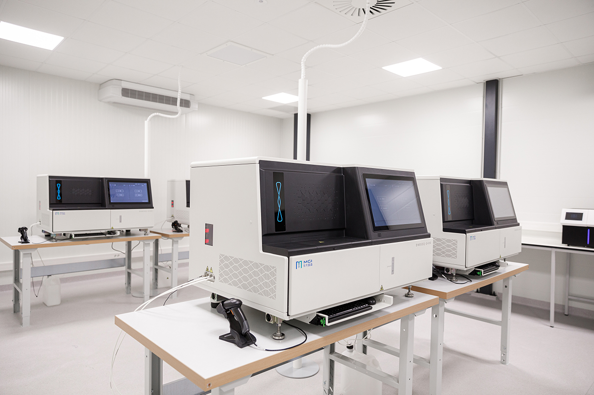

## Gegeven
Een baas is een substantie die eigenschappen heeft tegengesteld aan een zuur. **DNA-sequencing** is het proces waarbij de volgorde (sequentie) van nucleotiden in het DNA wordt vastgesteld. DNA-sequencing omvat alle methoden en technieken die onderzoekers gebruiken om de volgorde van de vier basen te bepalen: adenine, guanine, cytosine en thymine. De opkomst van snelle sequencing-methoden sinds de jaren 2000 vormde de basis voor vele belangrijke biologische en medische ontwikkelingen.
{:data-caption="Zo ziet een DNA-sequencer er uit!" width="300px"}

## Gevraagd
* Schrijf een programma dat vraagt naar een DNA	 sequentie (dus enkel de met de base: A,C,G of T) en de frequentie/aantal weergeeft voor elke base.
* Indien een letter in de DNA-sequentie niet A, C, G of T is, moet je een melding teruggeven.

#### Voorbeeld1
```
Geef een DNA - sequentie ( enkel A, C, G of T gebruiken ): 
ACGTGTACAGFCTAAAGTCCAGTCCGAATA
F is niet toegelaten!
Aantal A: 10
Aantal C: 7
Aantal G: 6
Aantal T: 6
Programme stopt
```
#### Voorbeeld2
```
Geef een DNA - sequentie ( enkel A, C, G of T gebruiken ): 
AAAXTCGAATCGGGT
X is niet toegelaten!
Aantal A: 5
Aantal C: 2
Aantal G: 4
Aantal T: 3
Programme stopt
```
